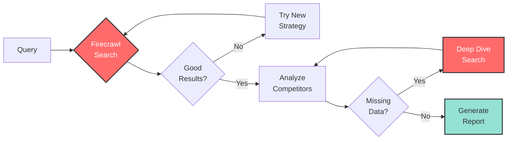

# Search Competitor Analysis (with LangGraph)

<div align="center">
  
</div>

AI-powered competitor analysis using LangGraph and Firecrawl's search endpoint.

## 🔍 This is a demonstration of search within Firecrawl

This example showcases the power of Firecrawl's `/search` endpoint with LangGraph orchestration:
- **Search for competitors** using queries like "alternatives to X" or "X competitors"
- **Get full page content** automatically scraped from each search result
- **Extract detailed insights** from the scraped content including features, pricing, and positioning
- **All in one API call** - no need to separately search then scrape
- **LangGraph workflow** - structured multi-node processing with state management

## How it Works



## 🤖 Agentic Features

This example demonstrates **agentic behavior** with LangGraph:

### 1. **Smart Search Retry Loop**
- Starts with standard search: "alternatives to X"
- If insufficient results, tries different strategies:
  - **VS search**: "X vs" to find comparison articles
  - **Year-specific**: "best X alternatives 2024"
  - **Like search**: "tools like X" or "sites like X"
- Continues until finding enough quality competitors

### 2. **Selective Deep Dive Loop**
- After initial competitor analysis, identifies missing data
- Performs targeted searches for specific information:
  - Missing pricing → searches "CompanyName pricing plans"
  - Missing features → searches "CompanyName features capabilities"
- Only deep dives when necessary, not for every competitor

### 3. **Decision Points**
- **After search**: Do we have enough competitors? → Retry or proceed
- **After analysis**: Is data complete? → Deep dive or generate report
- Makes intelligent decisions based on data quality

## Quick Start

1. Install dependencies:
```bash
npm install
```

2. Set up API keys in `.env`:
```
FIRECRAWL_API_KEY=your_firecrawl_api_key
OPENAI_API_KEY=your_openai_api_key
```

3. Run:
```bash
npm start
```

Enter a company name when prompted to get competitor analysis.

## Get API Keys
- Firecrawl: https://firecrawl.dev
- OpenAI: https://platform.openai.com

## Features
- Automated competitor discovery
- Market positioning analysis
- Feature comparison
- Strategic insights