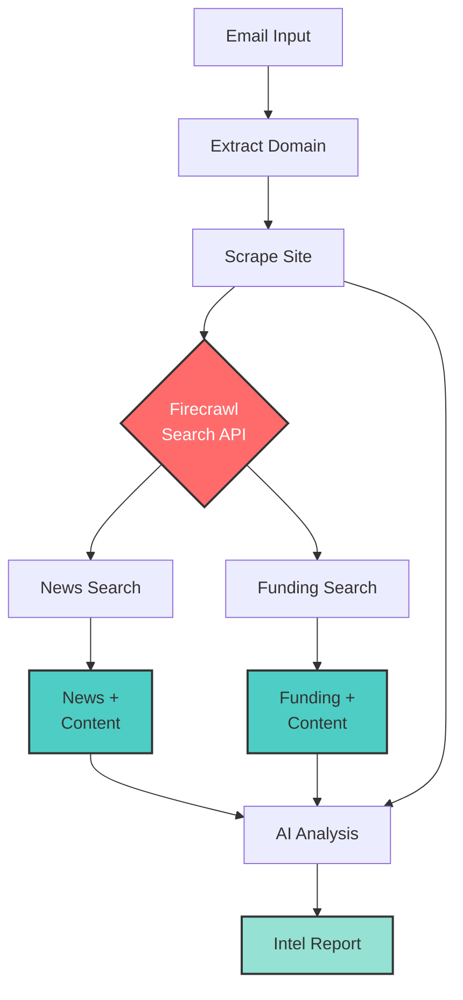

# Email to Company Intel (with LangGraph)

<div align="center">
  
</div>

Extract company intelligence from email addresses using Firecrawl's search endpoint and LangGraph for workflow orchestration.

## 🔍 This is a demonstration of search within Firecrawl

This example showcases how Firecrawl's `/search` endpoint combines web search with content scraping:
- **Search the web** for recent news, funding info, and company updates
- **Automatically scrape** the full content from search results in one API call
- **Extract structured data** from both search results and scraped content
- **Orchestrate with LangGraph** for structured, multi-step workflows

## How it Works



## Quick Start

1. Install dependencies:
```bash
npm install
```

2. Set up API keys in `.env`:
```
FIRECRAWL_API_KEY=your_firecrawl_api_key
OPENAI_API_KEY=your_openai_api_key
```

3. Run:
```bash
npm start
```

Enter an email address when prompted and get company intelligence report.

## Get API Keys
- Firecrawl: https://firecrawl.dev
- OpenAI: https://platform.openai.com