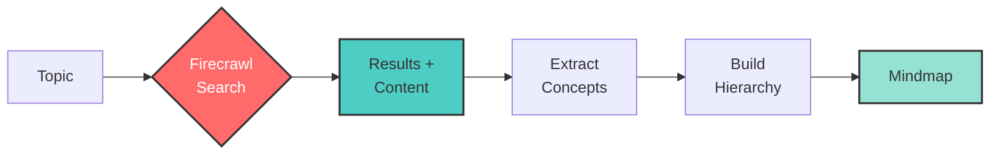

# Search to Mindmap

<div align="center">
  
</div>

Create interactive mind maps from search results using Firecrawl's search endpoint.

## 🔍 This is a demonstration of search within Firecrawl

This example demonstrates how Firecrawl's `/search` endpoint enables rich visualizations:
- **Search any topic** and get relevant web results
- **Automatically scrape full content** from each result with `scrapeOptions`
- **Extract key concepts** from the scraped markdown content
- **Build hierarchical mindmaps** from the comprehensive data

## How it Works



## Quick Start

1. Install dependencies:
```bash
npm install
```

2. Set up API keys in `.env`:
```
FIRECRAWL_API_KEY=your_firecrawl_api_key
OPENAI_API_KEY=your_openai_api_key
```

3. Run:
```bash
npm start
```

Enter a search query when prompted to generate an interactive mindmap.

## Get API Keys
- Firecrawl: https://firecrawl.dev
- OpenAI: https://platform.openai.com

## Features
- Search-powered mindmap generation
- Interactive HTML visualization
- Auto-generated hierarchical structure
- Export to JSON format