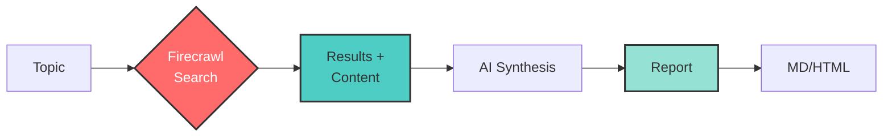

# Search to Report

<div align="center">
  
</div>

Generate professional research reports from search queries using Firecrawl's search endpoint.

## 🔍 This is a demonstration of search within Firecrawl

This example shows how Firecrawl's `/search` endpoint enables comprehensive research:
- **Search for any topic** and get the most relevant results
- **Scrape full content** from each result using `scrapeOptions: { formats: ["markdown"] }`
- **Synthesize information** from multiple sources into cohesive reports
- **Generate professional documents** with data from both search snippets and scraped content

## How it Works



## Quick Start

1. Install dependencies:
```bash
npm install
```

2. Set up API keys in `.env`:
```
FIRECRAWL_API_KEY=your_firecrawl_api_key
OPENAI_API_KEY=your_openai_api_key
```

3. Run:
```bash
npm start
```

Enter a search query when prompted to generate a research report.

## Get API Keys
- Firecrawl: https://firecrawl.dev
- OpenAI: https://platform.openai.com

## Features
- Professional research report generation
- Multi-source data synthesis
- Export to Markdown and HTML
- Executive summary generation