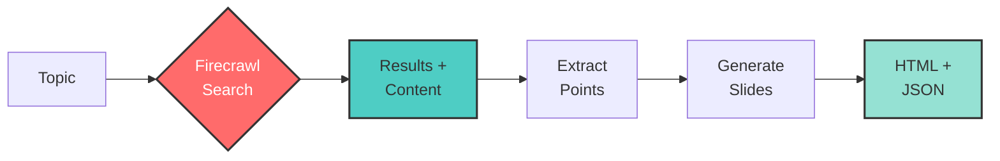

# Search to Slides

<div align="center">
  
</div>

Create presentation slides from search results using Firecrawl's search endpoint.

## 🔍 This is a demonstration of search within Firecrawl

This example highlights how Firecrawl's `/search` endpoint streamlines content creation:
- **Search for presentation topics** and get comprehensive results
- **Extract full content** from web pages with the search API's built-in scraping
- **Transform scraped data** into structured slide content
- **Create presentations** with rich information from multiple sources

## How it Works



## Quick Start

1. Install dependencies:
```bash
npm install
```

2. Set up API keys in `.env`:
```
FIRECRAWL_API_KEY=your_firecrawl_api_key
OPENAI_API_KEY=your_openai_api_key
```

3. Run:
```bash
npm start
```

Enter a search query when prompted to generate presentation slides.

## Get API Keys
- Firecrawl: https://firecrawl.dev
- OpenAI: https://platform.openai.com

## Features
- Auto-generated presentation slides
- Search-powered content creation
- Interactive HTML slideshow
- Export to JSON outline